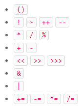
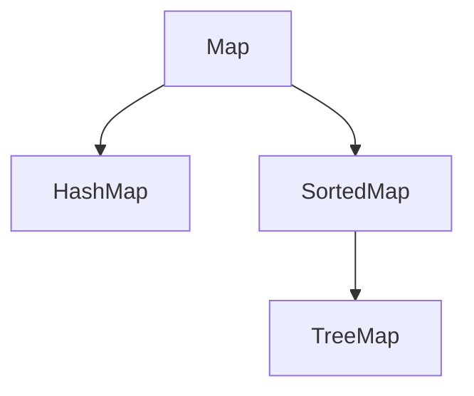

# Java教程

## Java简介

- Java SE ：`Standard Edition` **(标准版：JVM和标准库)**
- Java EE ：`Enterprise Edition` **（企业版：标准版基础上添加大量API和库）**
- Java ME ：`Micro Edition` **（针对嵌入版）**

## 特有名词

- JDK ：`Java Development Kit` **(JRE and Compiler , dubugger , etc)**
- JRE ： `Java Runtime Environment` **(JVM+Rumtime Library)**
- JSR :   `Java Specification Request` **(JSR是一系列的规范，从JVM的内存模型到Web程序接口，全部都标准化了。而负责审核JSR的组织就是JCP。)**
- JCP :   `Java Community Process`
- RI  :  `Reference Implementation`
- TCK : `Technology Compatibility Kit`

## Bin

- java : **运行Java程序，就是启动JVM，然后让JVM执行指定的编译后的代码；**
- javac : **这是Java的编译器，它用于把Java源码文件（以`.java`后缀结尾）编译为Java字节码文件（以`.class`后缀结尾）；**
- jar : **(用于把一组`.class`文件打包成一个`.jar`文件，便于发布；);**
- javadoc : **(用于从Java源码中自动提取注释并生成文档；);**
- jdb : **Java调试器，用于开发阶段的运行调试。**

## 补码

>```java
>&  不会短路，代码两端的条件都会执行。 可以作用于两个byte数组(两个都是1得到1);
>&& 会短路，如果一个条件不满足，不会执行第二个条件;
>|  作用于数组的时候（有一个1得1）;
>^  异或 不同的得1 ;
>~  只能作用一个byte变量，1变0，0变1  ;
>例如：
>  & 0xFF  0xFF表示数的二进制11111111 和其进行&计算低八位不会发生变化，可以用于获取一个数低八位。
>>>  带符号右移  >>>  无符号右移
>    <<  左移运算符  向左移，低位补0   x<<3
>    >>  右移运算符  向右移，正数高位补0，负数高位补1
>   >>> 无符号右移  向右移，高位补0
>```
>
>```
>在 二进制中  正数和负数的表现形式
>	分为：  原码表示正数，补码表示负数，
>	计算机中存储的数是二进制形式的是带符号的，最高位是符号为即：正数为0，负数为1。符号位只代表正负
>	原码：符号位+这个数的绝对值的二进制。
>	反码：正数的反码是其本身,负数的反码是在其原码基础上，符号位不变，其余各位取反。
>	补码：正数的补码就是其本身,负数的补码是反码的基础上加一。
>为什么会出现原码，反码，补码。
>    计算机计算加减乘除已经是最基础的计算了，如果计算机要辨别符号位，会显得计算机的基础电路非常复杂！于是人们想出了符号位也参与计算的办法。
>    根据加减法，减去一个数等于加上一的负数，即1-1=1+（-1）= 0 。于是出现了反码：
>    1-1=1+（-1）=（原码）00000001+10000001=（反码）00000001+11111110=（反码）11111111=（原码）00000000=0
>    这样会有一个问题，就是0会有两种表现形式：00000000和10000000 ， +0和-0
>    为了解决0的问题，于是补码就出现了：
>    1-1=1+（-1）=（原码）00000001+10000001=（补码）00000001+11111111=（补码）00000000=（原码）00000000=0
>    这样就不存在-0，而且还可以用10000000表示-128
>    （-1）+（-127）=（原码）10000001+11111111=（补码）11111111+10000001=（补码）10000000=（原码）00000000=-128
>    所以补码10000000表示-128，-128没有原码和反码，
>    使用补码，不仅仅修复了0的符号以及存在的两个编码的问题，而且还能够多表示一个最低数，这就是八位二进制【原码】【反码】范围是【-127，+127】 而补码的范围是【-128，127】
>```

## Java程序基础

### 基本数据类型`(基本数据类型是CPU可以直接进行运算的类型)`

- byte   `1字节`

- short   `2字节`

- int    `4字节`

- long   `8字节`

  > 对于整型类型，Java只定义了带符号的整型，因此，最高位的bit表示符号位（0表示正数，1表示负数）。
  >
  > 同一个数的不同进制的表示是完全相同的，例如`15`=`0xf`＝`0b1111`。

- float   `4字节`

- double   `8字节`

> 浮点数
>
> ```java
> float f1 = 3.14f;
> float f2 = 3.14e38f; // 科学计数法表示的3.14x10^38
> double d2 = -1.79e308;
> double d3 = 4.9e-324; // 科学计数法表示的4.9x10^-324
> ```

- char   `2字节`

- > char   字符类型`char`是基本数据类型，它是`character`的缩写。一个`char`保存一个Unicode字符。

- boolean

- > Java语言对布尔类型的存储并没有做规定，因为理论上存储布尔类型只需要1 bit，但是通常JVM内部会把`boolean`表示为4字节整数。

>计算机内存的最小存储单元是字节（byte），一个字节就是一个8位二进制数，即8个bit。它的二进制表示范围从`00000000`~`11111111`，换算成十进制是0~255，换算成十六进制是`00`~`ff`。
>
>一个字节是1byte，1024字节是1K，1024K是1M，1024M是1G，1024G是1T。

### 引用类型   

>`(引用类型的变量类似于C语言的指针，它内部存储一个“地址”，指向某个对象在内存的位置)`

- String 

### 常量

> 定义变量的时候，如果加上`final`修饰符，这个变量就变成了常量。

### var

> 有些时候，类型的名字太长，写起来比较麻烦。
>
> ```java
> StringBuilder sb = new StringBuilder();
> var sb = new StringBuilder();
> ```

### 运算

> 整数运算超出范围会溢出，得到奇怪的结果。
>
> 在一个复杂的四则运算中，两个整数的运算不会出现自动提升的情况。
>
> 计算顺序：
>
> 

> 浮点数`0.1`在计算机中就无法精确表示，因为十进制的`0.1`换算成二进制是一个无限循环小数，很显然，无论使用`float`还是`double`，都只能存储一个`0.1`的近似值。但是，`0.5`这个浮点数又可以精确地表示。
>
> 由于浮点数存在运算误差，所以比较两个浮点数是否相等常常会出现错误的结果。正确的比较方法是判断两个浮点数之差的绝对值是否小于一个很小的数。
>
> ```
> //三种特殊的类型
> double d1 = 0.0 / 0; // NaN
> double d2 = 1.0 / 0; // Infinity
> double d3 = -1.0 / 0; // -Infinity
> ```

### 打印

> ```java
> System.out.printf("n=%d, hex=%08x", n, n);
> //格式化输出
> /*
> 		%d  格式化输出证书
> 		%x  格式化输出十六进制整数
> 		%f  格式化输出浮点数
> 		%e  格式化输出科学计数法表示的浮点数
> 		%s  格式化字符串	
> */
> ```

### 输入

> ```java
> Scanner scanner = new Scanner(System.in);
> String name = scanner.nextLine();
> ```

### Switch

> ```java
> switch(name){
>     case :
>         break;
>     default :
>         System.out.println();
> }
> ```
>
> 新语法：
>
> 注意新语法使用`->`，如果有多条语句，需要用`{}`括起来。不要写`break`语句，因为新语法只会执行匹配的语句，没有穿透效应。需要JDK12
>
> ```java
> switch(name){
>         case  "A" -> {
>             
>         }
>         default ->{
>             
>         }
> }
> //新语法的第二种：
> int opt  =  switch(name){
>         case "A" -> 1;
>         case "B" -> 2;
>         default -> 0;
> }
> //新语法的第三种：yield  返回值
> int opt  =  switch(name){
>         case "A" -> 1;
>         case "B" -> 2;
>         default -> {
>             int bb = 12;
>             yield  bb;
>         };
> }
> ```
>
> 

## 数组的排序

#### Array.sort()

## 面向对象编程

- 面向编程编程：

  ​			`Object-Oriented Programming`

  - `class` `实例` `方法` 

    >public 可以用来修饰class或者field,表示这个class或者字段是可以被访问的.
    >
    >private  表示只能是私有的可以访问.
    >
    >没有构造函数初始化,引用类型的字段默认是是null,数值类型的默认值是:0,flase
    >
    >Overload,方法重载.

  - `继承` `多态`

    > java只允许单继承,所有类最终的根类是class  Object
    >
    > extends继承:子类自动获得了父类的所有字段，严禁定义与父类重名的字段！
    >
    > OOP的术语中，我们把`Person`称为超类（super class），父类（parent class），基类（base class），把`Student`称为子类（subclass），扩展类（extended class）。
    >
    > Java只允许一个class继承自一个类，因此，一个类有且仅有一个父类。只有`Object`特殊，它没有父类。
    >
    > ```java
    > //protected关键字可以把字段和方法的访问权限控制在继承树内部，一个protected字段和方法可以被其子类，以及子类的子类所访问
    > //继承有个特点，就是子类无法访问父类的`private`字段或者`private`方法。
    > protected String name;
    > protected int age;
    > protected String getName(){
    >         return "Hello";
    > }
    > //super关键字表示父类（超类）。
    > protected String getName() {
    >         return super.getName();
    > }
    > ```
    >
    > 任何`class`的构造方法，第一行语句必须是调用父类的构造方法。如果没有明确地调用父类的构造方法，编译器会帮我们自动加一句`super();`
    >
    > ```java
    > //final 修饰符
    > public final class Teacher(){}
    > //表示这个类不允许被继承
    > 
    > protected final String age = "haha";
    > //表示这个变量不允许被更改
    > 
    > public final String getName(){}
    > //表示这个方法不允许被重写Override
    > ```
    >
    > --jdk15中:
    >
    > ```java
    > public sealed class Shape permits Rect, Circle, Triangle {
    >     ...
    > }
    > //sealed表示密封:配合permits:表示只允许Rect等类可以继承Shape
    > //sealed类在Java 15中目前是预览状态，要启用它，必须使用参数--enable-preview和--source 15。
    > ```
    >
    > 向上转型和向下转型:
    >
    > ```java
    > //Student是Person的子类
    > Person person = new Student();
    > //这个是向上转型:允许的.
    > 
    > Student student = (Student)new Person();
    > //向下转型会报错
    > 
    > Person person = new Student();
    > Student student = (Student)person;
    > //person本来就是Student,所以这个是可以的
    > 
    > //instanceof实际上判断一个变量所指向的实例是否是指定类型，或者这个类型的子类。如果一个引用变量为null，那么对任何instanceof的判断都为false。
    > //即上述可以改为:
    > 
    > Person person = new Student();
    > if (person instanceof Student) {
    >     // 只有判断成功才会向下转型:
    >     Student student = (Student)person;// 一定会成功
    > }
    > //从Java 14开始，判断instanceof后，可以直接转型为指定变量，避免再次强制转型。例如，对于以下代码：
    > Person person = new Student();
    > if (person instanceof Student studebt) {
    >     //即已经转型成功了
    > }
    > ```

    > 多态 Polymorphic
    >
    > 在继承关系中，子类如果定义了一个与父类方法签名完全相同的方法，被称为覆写（Override）。
    >
    > 多态的特性就是，运行期才能动态决定调用的子类方法。对某个类型调用某个方法，执行的实际方法可能是某个子类的覆写方法。
    >
    > Object
    >
    > - `toString()`：把instance输出为`String`；
    > - `equals()`：判断两个instance是否逻辑相等；
    > - `hashCode()`：计算一个instance的哈希值。

    > 如果一个`class`定义了方法，但没有具体执行代码，这个方法就是抽象方法，抽象方法用`abstract`修饰。
    >
    > ```java
    >  abstract class Person {
    >     public abstract void run();
    > }
    > ```
    >
    > //这种尽量引用高层类型，避免引用实际子类型的方式，称之为面向抽象编程。
    >
    > `interface`，就是比抽象类还要抽象的纯抽象接口，因为它连字段都不能有。因为接口定义的所有方法默认都是`public abstract`.  字段都是 : `public static final`
    >
    > `implements`  用于实现.
    >
    > 一个`interface`可以继承自另一个`interface`。`interface`继承自`interface`使用`extends`
    >
    > 在`interface`中由`default`方法,`default`方法的目的是，当我们需要给接口新增一个方法时，会涉及到修改全部子类。如果新增的是`default`方法，那么子类就不必全部修改，只需要在需要覆写的地方去覆写新增方法。

    > 静态字段和静态方法都是class中的而不是实例中的

  - `package` `classpath` `jar`

  - 

- 面向过程编程：

## JDK9模块化

## JAVA核心类

- String

  - String.format();//%s字符串,%d整数,%x十六进制整数,%f浮点数
  - String.replace()替换
  - String.join()拼接
  - String.split();

- StringBuilder

  - 线程不安全,可变的

- StringBuffer

  - 线程安全,可变的

- 自动装箱(Auto Boxing)

- Number

  - 所有的整数和浮点数的包装类型都继承自`Number`，因此，可以非常方便地直接通过包装类型获取各种

  - ```java
    // 向上转型为Number:
    Number num = new Integer(999);
    // 获取byte, int, long, float, double:
    byte b = num.byteValue();
    int n = num.intValue();
    long ln = num.longValue();
    float f = num.floatValue();
    double d = num.doubleValue();
    ```

- 枚举类

  - > ```java
    > public enum Color{
    >     RED,GREEN,BLUE;
    > }
    > //编译之后
    > public final class Color extends Enum { // 继承自Enum，标记为final class
    >     // 每个实例均为全局唯一:
    >     public static final Color RED = new Color();
    >     public static final Color GREEN = new Color();
    >     public static final Color BLUE = new Color();
    >     // private构造方法，确保外部无法调用new操作符:
    >     private Color() {}
    > }
    > ```
    >
    > ```java
    > public enum Color{
    >     RED,GREEN,BLUE;
    >     
    >     private final String name;
    >     private Color(String name){
    >         this.name = name;
    >     };
    > }
    > ```

- 记录类

  - > 记录类:
    >
    > ```java
    > public final class Point {
    >  private final int x;
    >  private final int y;
    > 
    >  public Point(int x, int y) {
    >      this.x = x;
    >      this.y = y;
    >  }
    > 
    >  public int x() {
    >      return this.x;
    >  }
    > 
    >  public int y() {
    >      return this.y;
    >  }
    > }
    > ```
    >
    > 在JDK14中出现record
    >
    > ```java
    > public record Point(int x, int y) {}
    > //上述相当于一下代码
    > public final class Point extends Record {
    >  private final int x;
    >  private final int y;
    > 
    >  public Point(int x, int y) {
    >      this.x = x;
    >      this.y = y;
    >  }
    > 
    >  public int x() {
    >      return this.x;
    >  }
    > 
    >  public int y() {
    >      return this.y;
    >  }
    > 
    >  public String toString() {
    >      return String.format("Point[x=%s, y=%s]", x, y);
    >  }
    > 
    >  public boolean equals(Object o) {
    >      ...
    >  }
    >  public int hashCode() {
    >      ...
    >  }
    > }
    > ```
    >
    > ```java
    > //构造方法
    > public record Point(int x, int y) {
    >     public Point {
    >         if (x < 0 || y < 0) {
    >             throw new IllegalArgumentException();
    >         }
    >     }
    > }
    > //如下
    > public final class Point extends Record {
    >     public Point(int x, int y) {
    >         // 这是我们编写的Compact Constructor:
    >         if (x < 0 || y < 0) {
    >             throw new IllegalArgumentException();
    >         }
    >         // 这是编译器继续生成的赋值代码:
    >         this.x = x;
    >         this.y = y;
    >     }
    >     ...
    > }
    > ```
    >
    > ```java
    > //作为record的Point仍然可以添加静态方法。一种常用的静态方法是of()方法，用来创建Point
    > public record Point(int x, int y) {
    >     public static Point of() {
    >         return new Point(0, 0);
    >     }
    >     public static Point of(int x, int y) {
    >         return new Point(x, y);
    >     }
    > }
    > ```
    
  - BigInteger

  - BigDecimal

    > `BigDecimal`做加、减、乘时，精度不会丢失，但是做除法时，存在无法除尽的情况，这时，就必须指定精度以及如何进行截断
    >
    > ```java
    > BigDecimal d1 = new BigDecimal("123.456");
    > BigDecimal d2 = new BigDecimal("23.456789");
    > BigDecimal d3 = d1.divide(d2, 10, RoundingMode.HALF_UP); // 保留10位小数并四舍五入
    > BigDecimal d4 = d1.divide(d2); // 报错：ArithmeticException，因为除不尽
    > ```
    >
    > 还可以对`BigDecimal`做除法的同时求余数：
    >
    > ```java
    > import java.math.BigDecimal;
    > 
    > public class Main {
    >     public static void main(String[] args) {
    >         BigDecimal n = new BigDecimal("12.345");
    >         BigDecimal m = new BigDecimal("0.12");
    >         BigDecimal[] dr = n.divideAndRemainder(m);
    >         System.out.println(dr[0]); // 102
    >         System.out.println(dr[1]); // 0.105
    >     }
    > }
    > //调用divideAndRemainder()方法时，返回的数组包含两个BigDecimal，分别是商和余数，其中商总是整数，余数不会大于除数。我们可以利用这个方法判断两个BigDecimal是否是整数倍数：
    > ```
    >
    > 比较BigDecimal
    >
    > ```java
    > BigDecimal d1 = new BigDecimal("123.456");
    > BigDecimal d2 = new BigDecimal("123.45600");
    > System.out.println(d1.equals(d2)); // false,因为scale不同
    > System.out.println(d1.equals(d2.stripTrailingZeros())); // true,因为d2去除尾部0后scale变为2
    > System.out.println(d1.compareTo(d2)); // 0
    > //必须使用compareTo()方法来比较，它根据两个值的大小分别返回负数、正数和0，分别表示小于、大于和等于。
    > ```
    >
    > 如果查看`BigDecimal`的源码，可以发现，实际上一个`BigDecimal`是通过一个`BigInteger`和一个`scale`来表示的，即`BigInteger`表示一个完整的整数，而`scale`表示小数位数：
    >
    > ```java
    > public class BigDecimal extends Number implements Comparable<BigDecimal> {
    >     private final BigInteger intVal;
    >     private final int scale;
    > }
    > //BigDecimal也是从Number继承的，也是不可变对象。
    > ```

  - ​	常用工具类

    > ` Math`
    >
    > ```java
    > Math.abs();
    > Math.max();
    > Math.min();
    > Math.pow(x,y);//x的y次方
    > Math.sprt(x);//根号下x
    > Math.exp(x);//e的x次方
    > Math.log(x);//以e为底x的对数
    > Math.log10(x);//以10为底x的对数
    > Math.sin(3.14); // 0.00159...
    > Math.cos(3.14); // -0.9999...
    > Math.tan(3.14); // -0.0015...
    > Math.asin(1.0); // 1.57079...
    > Math.acos(1.0); // 0.0
    > double pi = Math.PI; // 3.14159...
    > double e = Math.E; // 2.7182818...
    > Math.random(); // 0.53907... 每次都不一样
    > ```
    >
    > `StrictMath`它提供了和`Math`几乎一模一样的方法。这两个类的区别在于，由于浮点数计算存在误差，不同的平台（例如x86和ARM）计算的结果可能不一致（指误差不同），因此，`StrictMath`保证所有平台计算结果都是完全相同的，而`Math`会尽量针对平台优化计算速度，所以，绝大多数情况下，使用`Math`就足够了。

    > ` Random`

    > `Random`用来创建伪随机数。所谓伪随机数，是指只要给定一个初始的种子，产生的随机数序列是完全一样的。
    >
    > 
    >
    > ```java
    > Random r = new Random();
    > r.nextInt(); // 2071575453,每次都不一样
    > r.nextInt(10); // 5,生成一个[0,10)之间的int
    > r.nextLong(); // 8811649292570369305,每次都不一样
    > r.nextFloat(); // 0.54335...生成一个[0,1)之间的float
    > r.nextDouble(); // 0.3716...生成一个[0,1)之间的double
    > ```
    >
    > `Math.random()`实际上内部调用了`Random`类，所以它也是伪随机数，只是我们无法指定种子。

    > SecureRandom

    > 有伪随机数，就有真随机数。实际上真正的真随机数只能通过量子力学原理来获取，而我们想要的是一个不可预测的安全的随机数，`SecureRandom`就是用来创建安全的随机数的
    >
    > ```java
    > SecureRandom sr = new SecureRandom();
    > System.out.println(sr.nextInt(100));
    > ```
    >
    > `SecureRandom`无法指定种子，它使用RNG（random number generator）算法。JDK的`SecureRandom`实际上有多种不同的底层实现，有的使用安全随机种子加上伪随机数算法来产生安全的随机数，有的使用真正的随机数生成器。实际使用的时候，可以优先获取高强度的安全随机数生成器，如果没有提供，再使用普通等级的安全随机数生成器
    >
    > ```java
    > public class Main {
    >     public static void main(String[] args) {
    >         SecureRandom sr = null;
    >         try {
    >             sr = SecureRandom.getInstanceStrong(); // 获取高强度安全随机数生成器
    >         } catch (NoSuchAlgorithmException e) {
    >             sr = new SecureRandom(); // 获取普通的安全随机数生成器
    >         }
    >         byte[] buffer = new byte[16];
    >         sr.nextBytes(buffer); // 用安全随机数填充buffer
    >         System.out.println(Arrays.toString(buffer));
    >     }
    > }
    > ```
    >
    > `SecureRandom`的安全性是通过操作系统提供的安全的随机种子来生成随机数。这个种子是通过CPU的热噪声、读写磁盘的字节、网络流量等各种随机事件产生的“熵”。
    >
    > 在密码学中，安全的随机数非常重要。如果使用不安全的伪随机数，所有加密体系都将被攻破。因此，时刻牢记必须使用`SecureRandom`来产生安全的随机数。

## 异常

- 介绍

  > ```ascii
  >                      ┌───────────┐
  >                     │  Object   │
  >                    └───────────┘
  >                            ▲
  >                           │
  >                      ┌───────────┐
  >                     │ Throwable │
  >                    └───────────┘
  >                            ▲
  >                  ┌─────────┴─────────┐
  >                 │                   │
  >            ┌───────────┐       ┌───────────┐
  >           │   Error   │       │ Exception │
  >          └───────────┘       └───────────┘
  >                  ▲                   ▲
  >          ┌───────┘              ┌────┴──────────┐
  >         │                      │               │
  >  ┌─────────────────┐    ┌─────────────────┐┌───────────┐
  > │OutOfMemoryError │... │RuntimeException ││IOException│...
  > └─────────────────┘    └─────────────────┘└───────────┘
  >                                 ▲
  >                     ┌───────────┴─────────────┐
  >                    │                         │
  >          ┌─────────────────────┐ ┌─────────────────────────┐
  >          │NullPointerException │ │IllegalArgumentException │...
  >          └─────────────────────┘ └─────────────────────────┘
  > ```
  >
  > 从继承关系可知：`Throwable`是异常体系的根，它继承自`Object`。`Throwable`有两个体系：`Error`和`Exception`，`Error`表示严重的错误，程序对此一般无能为力，例如：
  >
  > - `OutOfMemoryError`：内存耗尽
  > - `NoClassDefFoundError`：无法加载某个Class
  > - `StackOverflowError`：栈溢出
  >
  > 而`Exception`则是运行时的错误，它可以被捕获并处理。
  >
  > 某些异常是应用程序逻辑处理的一部分，应该捕获并处理。例如：
  >
  > - `NumberFormatException`：数值类型的格式错误
  > - `FileNotFoundException`：未找到文件
  > - `SocketException`：读取网络失败
  >
  > 还有一些异常是程序逻辑编写不对造成的，应该修复程序本身。例如：
  >
  > - `NullPointerException`：对某个`null`的对象调用方法或字段
  > - `IndexOutOfBoundsException`：数组索引越界
  >
  > `Exception`又分为两大类：
  >
  > 1. `RuntimeException`以及它的子类；
  >
  > 2. 非`RuntimeException`（包括`IOException`、`ReflectiveOperationException`等等）
  >
  >    `必须捕获的异常，包括`Exception`及其子类，但不包括`RuntimeException`及其子类，这种类型的异常称为Checked Exception`
  >
  >    `不需要捕获的异常，包括`Error`及其子类，`RuntimeException`及其子类。`
  >
  >    ```java
  >    public class Main {
  >        public static void main(String[] args) throws Exception {
  >            Exception origin = null;
  >            try {
  >                System.out.println(Integer.parseInt("abc"));
  >            } catch (Exception e) {
  >                origin = e;
  >                throw e;
  >            } finally {
  >                Exception e = new IllegalArgumentException();
  >                if (origin != null) {
  >                    e.addSuppressed(origin);
  >                }
  >                throw e;
  >            }
  >        }
  >    }
  >    //防止异常被屏蔽
  >    //通过Throwable.getSuppressed()可以获取所有的Suppressed Exception。
  >    //绝大多数情况下，在finally中不要抛出异常。因此，我们通常不需要关心Suppressed Exception。
  >    ```

  ## 自定义异常

  > ```ascii
  > Exception
  > │
  > ├─ RuntimeException
  > │  │
  > │  ├─ NullPointerException
  > │  │
  > │  ├─ IndexOutOfBoundsException
  > │  │
  > │  ├─ SecurityException
  > │  │
  > │  └─ IllegalArgumentException
  > │     │
  > │     └─ NumberFormatException
  > │
  > ├─ IOException
  > │  │
  > │  ├─ UnsupportedCharsetException
  > │  │
  > │  ├─ FileNotFoundException
  > │  │
  > │  └─ SocketException
  > │
  > ├─ ParseException
  > │
  > ├─ GeneralSecurityException
  > │
  > ├─ SQLException
  > │
  > └─ TimeoutException
  > ```
  >
  > 一个常见的做法是自定义一个`BaseException`作为“根异常”，然后，派生出各种业务类型的异常。

  ```java
  public class BaseException extends RuntimeException {
  }
  
  //其他业务类型的异常就可以从BaseException派生
  public class UserNotFoundException extends BaseException {
  }
  
  public class LoginFailedException extends BaseException {
  }
  
  //自定义的BaseException应该提供多个构造方法
  public class BaseException extends RuntimeException {
      public BaseException() {
          super();
      }
  
      public BaseException(String message, Throwable cause) {
          super(message, cause);
      }
  
      public BaseException(String message) {
          super(message);
      }
  
      public BaseException(Throwable cause) {
          super(cause);
      }
  }
  ```

  > NullPointerException
  >
  > ```java
  > //从Java 14开始，如果产生了NullPointerException，JVM可以给出详细的信息告诉我们null对象到底是谁。
  > public class Main {
  >     public static void main(String[] args) {
  >         Person p = new Person();
  >         System.out.println(p.address.city.toLowerCase());
  >     }
  > }
  > 
  > class Person {
  >     String[] name = new String[2];
  >     Address address = new Address();
  > }
  > 
  > class Address {
  >     String city;
  >     String street;
  >     String zipcode;
  > }
  > 
  > //这种增强的NullPointerException详细信息是Java 14新增的功能，但默认是关闭的，我们可以给JVM添加一个-XX:+ShowCodeDetailsInExceptionMessages参数启用它：
  > //java -XX:+ShowCodeDetailsInExceptionMessages Main.java
  > ```
  >
  > ```java
  > //java 中的断言
  > public static void main(String[] args) {
  >     int x = -1;
  >     assert x > 0;
  >     System.out.println(x);
  > }    
  > //这是因为JVM默认关闭断言指令，即遇到assert语句就自动忽略了，不执行。
  > 
  > //要执行assert语句，必须给Java虚拟机传递-enableassertions（可简写为-ea）参数启用断言。
  > ```
  >
  > 日志: 
  >
  > ```java
  > //java内置的
  > public static void main(String[] args) {
  >     Logger logger = Logger.getGlobal();
  >     logger.info("start process...");
  >     logger.warning("memory is running out...");
  >     logger.fine("ignored.");
  >     logger.severe("process will be terminated...");
  > }
  > 
  > 
  > ```
  >
  > JDK  的 Logging  默认七个级别
  >
  > - SEVERE
  >
  > - WARNING
  >
  > - INFO(默认)
  >
  > - CONFIG
  >
  > - FINE
  >
  > - FINER
  >
  > - FINEST
  >
  > - Logging系统在JVM启动时读取配置文件并完成初始化，一旦开始运行`main()`方法，就无法修改配置；
  >
  >   配置不太方便，需要在JVM启动时传递参数`-Djava.util.logging.config.file=<config-file-name>`。
  >
  >   因此，Java标准库内置的Logging使用并不是非常广泛。更方便的日志系统我们稍后介绍。
  >
  > Commons Logging
  >
  > 和Java标准库提供的日志不同，Commons Logging是一个第三方日志库，它是由Apache创建的日志模块。
  >
  > Commons Logging的特色是，它可以挂接不同的日志系统，并通过配置文件指定挂接的日志系统。默认情况下，Commons Loggin自动搜索并使用Log4j（Log4j是另一个流行的日志系统），如果没有找到Log4j，再使用JDK Logging。
  >
  > Commons Logging定义了6个日志级别：
  >
  > - FATAL
  > - ERROR
  > - WARNING
  > - INFO(默认)
  > - DEBUG
  > - TRACE
  >
  > ```java
  > // 在静态方法中引用Log:
  > public class Main {
  >     static final Log log = LogFactory.getLog(Main.class);
  > 
  >     static void foo() {
  >         log.info("foo");
  >     }
  > }
  > 
  > // 在实例方法中引用Log:
  > public class Person {
  >     protected final Log log = LogFactory.getLog(getClass());
  > 
  >     void foo() {
  >         log.info("foo");
  >     }
  > }
  > 
  > //注意到实例变量log的获取方式是LogFactory.getLog(getClass())，虽然也可以用LogFactory.getLog(Person.class)，但是前一种方式有个非常大的好处，就是子类可以直接使用该log实例。
  > 
  > 
  > ```
  >
  > Log4j
  >
  > ```java
  > log.info("User signed in.");
  >  │
  >  │   ┌──────────┐    ┌──────────┐    ┌──────────┐    ┌──────────┐
  >  ├──>│ Appender │───>│  Filter  │───>│  Layout  │───>│ Console  │
  >  │   └──────────┘    └──────────┘    └──────────┘    └──────────┘
  >  │
  >  │   ┌──────────┐    ┌──────────┐    ┌──────────┐    ┌──────────┐
  >  ├──>│ Appender │───>│  Filter  │───>│  Layout  │───>│   File   │
  >  │   └──────────┘    └──────────┘    └──────────┘    └──────────┘
  >  │
  >  │   ┌──────────┐    ┌──────────┐    ┌──────────┐    ┌──────────┐
  >  └──>│ Appender │───>│  Filter  │───>│  Layout  │───>│  Socket  │
  >      └──────────┘    └──────────┘    └──────────┘    └──────────┘
  > ```
  >
  > 当我们使用Log4j输出一条日志时，Log4j自动通过不同的Appender把同一条日志输出到不同的目的地。例如：
  >
  > - console：输出到屏幕；
  > - file：输出到文件；
  > - socket：通过网络输出到远程计算机；
  > - jdbc：输出到数据库
  >
  > 在输出日志的过程中，通过Filter来过滤哪些log需要被输出，哪些log不需要被输出。例如，仅输出`ERROR`级别的日志。
  >
  > 最后，通过Layout来格式化日志信息，例如，自动添加日期、时间、方法名称等信息。
  >
  > 上述结构虽然复杂，但我们在实际使用的时候，并不需要关心Log4j的API，而是通过配置文件来配置它。
  >
  > 虽然配置Log4j比较繁琐，但一旦配置完成，使用起来就非常方便。
  >
  > ```xml
  > <?xml version="1.0" encoding="UTF-8"?>
  > <Configuration>
  > 	<Properties>
  >         <!-- 定义日志格式 -->
  > 		<Property name="log.pattern">%d{MM-dd HH:mm:ss.SSS} [%t] %-5level %logger{36}%n%msg%n%n</Property>
  >         <!-- 定义文件名变量 -->
  > 		<Property name="file.err.filename">log/err.log</Property>
  > 		<Property name="file.err.pattern">log/err.%i.log.gz</Property>
  > 	</Properties>
  >     <!-- 定义Appender，即目的地 -->
  > 	<Appenders>
  >         <!-- 定义输出到屏幕 -->
  > 		<Console name="console" target="SYSTEM_OUT">
  >             <!-- 日志格式引用上面定义的log.pattern -->
  > 			<PatternLayout pattern="${log.pattern}" />
  > 		</Console>
  >         <!-- 定义输出到文件,文件名引用上面定义的file.err.filename -->
  > 		<RollingFile name="err" bufferedIO="true" fileName="${file.err.filename}" filePattern="${file.err.pattern}">
  > 			<PatternLayout pattern="${log.pattern}" />
  > 			<Policies>
  >                 <!-- 根据文件大小自动切割日志 -->
  > 				<SizeBasedTriggeringPolicy size="1 MB" />
  > 			</Policies>
  >             <!-- 保留最近10份 -->
  > 			<DefaultRolloverStrategy max="10" />
  > 		</RollingFile>
  > 	</Appenders>
  > 	<Loggers>
  > 		<Root level="info">
  >             <!-- 对info级别的日志，输出到console -->
  > 			<AppenderRef ref="console" level="info" />
  >             <!-- 对error级别的日志，输出到err，即上面定义的RollingFile -->
  > 			<AppenderRef ref="err" level="error" />
  > 		</Root>
  > 	</Loggers>
  > </Configuration>
  > ```
  >
  > 对上面的配置文件，凡是`INFO`级别的日志，会自动输出到屏幕，而`ERROR`级别的日志，不但会输出到屏幕，还会同时输出到文件。并且，一旦日志文件达到指定大小（1MB），Log4j就会自动切割新的日志文件，并最多保留10份。
  >
  > 在开发阶段，始终使用Commons Logging接口来写入日志，并且开发阶段无需引入Log4j。如果需要把日志写入文件， 只需要把正确的配置文件和Log4j相关的jar包放入`classpath`，就可以自动把日志切换成使用Log4j写入，无需修改任何代码。

  SLF4J类似于Commons Logging，也是一个日志接口，而Logback类似于Log4j，是一个日志的实现。

  从目前的趋势来看，越来越多的开源项目从Commons Logging加Log4j转向了SLF4J加Logback

  

## 设计模式

- 静态工厂方法

  > ```java
  > Integer n = new Integer(100);
  > Integer n = Integer.valueOf(100);
  > //方法2更好，因为方法1总是创建新的Integer实例，方法2把内部优化留给Integer的实现者去做，即使在当前版本没有优化，也有可能在下一个版本进行优化。
  > ```
  >
  > 
  >
  > 


## 反射

- Reflection:Java的反射是指程序在运行期可以拿到一个对象的所有信息。

> 反射是为了解决在运行期，对某个实例一无所知的情况下，如何调用其方法。
>
> 除了`int`等基本类型外，Java的其他类型全部都是`class`（包括`interface`）。仔细思考，我们可以得出结论：`class`（包括`interface`）的本质是数据类型（`Type`）。
>
> 而`class`是由JVM在执行过程中动态加载的。JVM在第一次读取到一种`class`类型时，将其加载进内存。
>
> 每加载一种`class`，JVM就为其创建一个`Class`类型的实例，并关联起来。注意：这里的`Class`类型是一个名叫`Class`的`class`。
>
> ```java
> public final class Class {
> private Class() {}
> }
> ```
>
> 以`String`类为例，当JVM加载`String`类时，它首先读取`String.class`文件到内存，然后，为`String`类创建一个`Class`实例并关联起来：
>
> ```java
> Class cls = new Class(String);
> ```
>
> 这个`Class`实例是JVM内部创建的，如果我们查看JDK源码，可以发现`Class`类的构造方法是`private`，只有JVM能创建`Class`实例，我们自己的Java程序是无法创建`Class`实例的。
>
> 所以，JVM持有的每个`Class`实例都指向一个数据类型（`class`或`interface`）
>
> 一个`Class`实例包含了该`class`的所有完整信息：
>
> 由于JVM为每个加载的`class`创建了对应的`Class`实例，并在实例中保存了该`class`的所有信息，包括类名、包名、父类、实现的接口、所有方法、字段等，因此，如果获取了某个`Class`实例，我们就可以通过这个`Class`实例获取到该实例对应的`class`的所有信息。
>
> 这种通过`Class`实例获取`class`信息的方法称为反射（Reflection）。
>
> 方法一：直接通过一个`class`的静态变量`class`获取：
>
> ```java
> Class cls = String.class;
> ```
>
> 方法二：如果我们有一个实例变量，可以通过该实例变量提供的`getClass()`方法获取：
>
> ```java
> String s = "Hello";
> Class cls = s.getClass();
> ```
>
> 方法三：如果知道一个`class`的完整类名，可以通过静态方法`Class.forName()`获取：
>
> ```java
> Class cls = Class.forName("java.lang.String");
> ```
>
> 因为`Class`实例在JVM中是唯一的，所以，上述方法获取的`Class`实例是同一个实例。可以用`==`比较两个`Class`实例：
>
> 用`instanceof`不但匹配指定类型，还匹配指定类型的子类。而用`==`判断`class`实例可以精确地判断数据类型，但不能作子类型比较.
>
> ```java
> 		System.out.println("Class name: " + cls.getName());
>   System.out.println("Simple name: " + cls.getSimpleName());
>   if (cls.getPackage() != null) {
>       System.out.println("Package name: " + cls.getPackage().getName());
>   }
>   System.out.println("is interface: " + cls.isInterface());
>   System.out.println("is enum: " + cls.isEnum());
>   System.out.println("is array: " + cls.isArray());
>   System.out.println("is primitive: " + cls.isPrimitive());
> ```
>
> 注意到数组（例如`String[]`）也是一种`Class`，而且不同于`String.class`，它的类名是`[Ljava.lang.String`。此外，JVM为每一种基本类型如int也创建了`Class`，通过`int.class`访问。
>
> ```java
> 
> // 获取String的Class实例:
> Class cls = String.class;
> // 创建一个String实例:
> String s = (String) cls.newInstance();
> 
> //上述代码相当于new String()。通过Class.newInstance()可以创建类实例，它的局限是：只能调用public的无参数构造方法。带参数的构造方法，或者非public的构造方法都无法通过Class.newInstance()被调用。
> ```
>
> JVM动态加载`class`的特性:JVM在执行Java程序的时候，并不是一次性把所有用到的class全部加载到内存，而是第一次需要用到class时才加载。
>
> 动态加载`class`的特性对于Java程序非常重要。利用JVM动态加载`class`的特性，我们才能在运行期根据条件加载不同的实现类。例如，Commons Logging总是优先使用Log4j，只有当Log4j不存在时，才使用JDK的logging。利用JVM动态加载特性，大致的实现代码如下：
>
> ```java
> // Commons Logging优先使用Log4j:
> LogFactory factory = null;
> if (isClassPresent("org.apache.logging.log4j.Logger")) {
> factory = createLog4j();
> } else {
> factory = createJdkLog();
> }
> 
> boolean isClassPresent(String name) {
> try {
>   Class.forName(name);
>   return true;
> } catch (Exception e) {
>   return false;
> }
> }
> ```

### 根据Class实例获取字段

> - Field getField(name)：根据字段名获取某个public的field（包括父类）
> - Field getDeclaredField(name)：根据字段名获取当前类的某个field（不包括父类）
> - Field[] getFields()：获取所有public的field（包括父类）
> - Field[] getDeclaredFields()：获取当前类的所有field（不包括父类）
>
> ```java
> // 获取private字段"grade":
> System.out.println(stdClass.getDeclaredField("grade"));
> ```

### 一个`Field`对象包含了一个字段的所有信息：

> - `getName()`：返回字段名称，例如，`"name"`；
>
> - `getType()`：返回字段类型，也是一个`Class`实例，例如，`String.class`；
>
> - `getModifiers()`：返回字段的修饰符，它是一个`int`，不同的bit表示不同的含义。
>
>   以`String`类的`value`字段为例，它的定义是：
>
>   ```
>   public final class String {
>       private final byte[] value;
>   }
>   ```
>
>   我们用反射获取该字段的信息，代码如下：
>
>   ```
>   Field f = String.class.getDeclaredField("value");
>   f.getName(); // "value"
>   f.getType(); // class [B 表示byte[]类型
>   int m = f.getModifiers();
>   Modifier.isFinal(m); // true
>   Modifier.isPublic(m); // false
>   Modifier.isProtected(m); // false
>   Modifier.isPrivate(m); // true
>   Modifier.isStatic(m); // false
>   ```
>
>   利用反射拿到字段的一个`Field`实例只是第一步，我们还可以拿到一个实例对应的该字段的值。
>
> ```java
> public class Main {
> 
>     public static void main(String[] args) throws Exception {
>         Object p = new Person("Xiao Ming");
>         Class c = p.getClass();
>         Field f = c.getDeclaredField("name");
>         //调用Field.setAccessible(true)的意思是，别管这个字段是不是public，一律允许访问。
> 		f.setAccessible(true);
>         Object value = f.get(p);
>         System.out.println(value); // "Xiao Ming"
>     }
> }
> 
> class Person {
>     private String name;
> 
>     public Person(String name) {
>         this.name = name;
>     }
> }
> ```
>
> 设置字段值是通过`Field.set(Object, Object)`实现的，其中第一个`Object`参数是指定的实例，第二个`Object`参数是待修改的值。示例代码如下：
>
> ```java
> public class Main {
> 
>     public static void main(String[] args) throws Exception {
>         Person p = new Person("Xiao Ming");
>         System.out.println(p.getName()); // "Xiao Ming"
>         Class c = p.getClass();
>         Field f = c.getDeclaredField("name");
>         f.setAccessible(true);
>         f.set(p, "Xiao Hong");
>         System.out.println(p.getName()); // "Xiao Hong"
>     }
> }
> 
> class Person {
>     private String name;
> 
>     public Person(String name) {
>         this.name = name;
>     }
> 
>     public String getName() {
>         return this.name;
>     }
> }
> ```

Method

> - `Method getMethod(name, Class...)`：获取某个`public`的`Method`（包括父类）
> - `Method getDeclaredMethod(name, Class...)`：获取当前类的某个`Method`（不包括父类）
> - `Method[] getMethods()`：获取所有`public`的`Method`（包括父类）
> - `Method[] getDeclaredMethods()`：获取当前类的所有`Method`（不包括父类）
>
> ```java
> public class Main {
>     public static void main(String[] args) throws Exception {
>         Class stdClass = Student.class;
>         // 获取public方法getScore，参数为String:
>         System.out.println(stdClass.getMethod("getScore", String.class));
>         // 获取继承的public方法getName，无参数:
>         System.out.println(stdClass.getMethod("getName"));
>         // 获取private方法getGrade，参数为int:
>         System.out.println(stdClass.getDeclaredMethod("getGrade", int.class));
>     }
> }
> 
> class Student extends Person {
>     public int getScore(String type) {
>         return 99;
>     }
>     private int getGrade(int year) {
>         return 1;
>     }
> }
> 
> class Person {
>     public String getName() {
>         return "Person";
>     }
> }
> ```
>
> 一个`Method`对象包含一个方法的所有信息：
>
> - `getName()`：返回方法名称，例如：`"getScore"`；
> - `getReturnType()`：返回方法返回值类型，也是一个Class实例，例如：`String.class`；
> - `getParameterTypes()`：返回方法的参数类型，是一个Class数组，例如：`{String.class, int.class}`；
> - `getModifiers()`：返回方法的修饰符，它是一个`int`，不同的bit表示不同的含义。
>
> 调用方法
>
> ```java
> String s = "Hello world";
> String r = s.substring(6); // "world"
> 
> public class Main {
>     public static void main(String[] args) throws Exception {
>         // String对象:
>         String s = "Hello world";
>         // 获取String substring(int)方法，参数为int:
>         Method m = String.class.getMethod("substring", int.class);
>         // 在s对象上调用该方法并获取结果:
>         String r = (String) m.invoke(s, 6);
>         // 打印调用结果:
>         System.out.println(r);
>     }
> }
> ```
>
> 如果获取到的Method表示一个静态方法，调用静态方法时，由于无需指定实例对象，所以`invoke`方法传入的第一个参数永远为`null`。
>
> ```java
> public class Main {
>     public static void main(String[] args) throws Exception {
>         // 获取Integer.parseInt(String)方法，参数为String:
>         Method m = Integer.class.getMethod("parseInt", String.class);
>         // 调用该静态方法并获取结果:
>         Integer n = (Integer) m.invoke(null, "12345");
>         // 打印调用结果:
>         System.out.println(n);
>     }
> }
> ```
>
> 为了调用非public方法，我们通过`Method.setAccessible(true)`允许其调用
>
> 调用构造方法
>
> - 如果通过反射来创建新的实例，可以调用Class提供的newInstance()方法：
>
> ```java
> Person p = Person.class.newInstance();
> 
> ```
>
> 调用Class.newInstance()的局限是，它只能调用该类的public无参数构造方法。如果构造方法带有参数，或者不是public，就无法直接通过Class.newInstance()来调用。
>
> 为了调用任意的构造方法，Java的反射API提供了Constructor对象，它包含一个构造方法的所有信息，可以创建一个实例。Constructor对象和Method非常类似，不同之处仅在于它是一个构造方法，并且，调用结果总是返回实例
>
> ```java
> public class Main {
>     public static void main(String[] args) throws Exception {
>         // 获取构造方法Integer(int):
>         Constructor cons1 = Integer.class.getConstructor(int.class);
>         // 调用构造方法:
>         Integer n1 = (Integer) cons1.newInstance(123);
>         System.out.println(n1);
> 
>         // 获取构造方法Integer(String)
>         Constructor cons2 = Integer.class.getConstructor(String.class);
>         Integer n2 = (Integer) cons2.newInstance("456");
>         System.out.println(n2);
>     }
> }
> 
> ```
>
> 通过Class实例获取Constructor的方法如下：
>
> - `getConstructor(Class...)`：获取某个`public`的`Constructor`；
> - `getDeclaredConstructor(Class...)`：获取某个`Constructor`；
> - `getConstructors()`：获取所有`public`的`Constructor`；
> - `getDeclaredConstructors()`：获取所有`Constructor`。
> - 调用非`public`的`Constructor`时，必须首先通过`setAccessible(true)`设置允许访问。

### 获取父类的Class

> ```java
> public class Main {
>     public static void main(String[] args) throws Exception {
>         Class i = Integer.class;
>         Class n = i.getSuperclass();
>         System.out.println(n);
>         Class o = n.getSuperclass();
>         System.out.println(o);
>         System.out.println(o.getSuperclass());
>     }
> }
> 
> ```

### 获取Interface

> ```java
> import java.lang.reflect.Method;
> public class Main {
>     public static void main(String[] args) throws Exception {
>         Class s = Integer.class;
>         Class[] is = s.getInterfaces();
>         for (Class i : is) {
>             System.out.println(i);
>         }
>     }
> }
> //运行上述代码可知，Integer实现的接口有：
> 
> //java.lang.Comparable
> //java.lang.constant.Constable
> //java.lang.constant.ConstantDesc
> ```

### 继承关系

> ```java
> Object n = Integer.valueOf(123);
> boolean isDouble = n instanceof Double; // false
> boolean isInteger = n instanceof Integer; // true
> boolean isNumber = n instanceof Number; // true
> boolean isSerializable = n instanceof java.io.Serializable; // true
> ```
>
> 如果是两个`Class`实例，要判断一个向上转型是否成立，可以调用`isAssignableFrom()`
>
> ```java
> // Integer i = ?
> Integer.class.isAssignableFrom(Integer.class); // true，因为Integer可以赋值给Integer
> // Number n = ?
> Number.class.isAssignableFrom(Integer.class); // true，因为Integer可以赋值给Number
> // Object o = ?
> Object.class.isAssignableFrom(Integer.class); // true，因为Integer可以赋值给Object
> // Integer i = ?
> Integer.class.isAssignableFrom(Number.class); // false，因为Number不能赋值给Integer
> ```
>
> 

### 动态代理

> Java的`class`和`interface`的区别
>
> - 可以实例化`class`（非`abstract`）；
> - 不能实例化`interface`。
>
> Java标准库提供了一种动态代理（Dynamic Proxy）的机制：可以在运行期动态创建某个`interface`的实例。
>
> 动态代理
>
> ​	动态代理是通过`Proxy`创建代理对象，然后将接口方法“代理”给`InvocationHandler`完成的。
>
> ```java
> import java.lang.reflect.InvocationHandler;
> import java.lang.reflect.Method;
> import java.lang.reflect.Proxy;
> public class Main {
>     public static void main(String[] args) {
>         //定义一个InvocationHandler实例，它负责实现接口的方法调用；
>         InvocationHandler handler = new InvocationHandler() {
>             @Override
>             public Object invoke(Object proxy, Method method, Object[] args) throws Throwable {
>                 System.out.println(method);
>                 if (method.getName().equals("morning")) {
>                     System.out.println("Good morning, " + args[0]);
>                 }
>                 return null;
>             }
>         };
>         //通过Proxy.newProxyInstance()创建interface实例，它需要3个参数：
>             //使用的ClassLoader，通常就是接口类的ClassLoader；
>             //需要实现的接口数组，至少需要传入一个接口进去；
>             //用来处理接口方法调用的InvocationHandler实例。
>         //将返回的Object强制转型为接口。
>         Hello hello = (Hello) Proxy.newProxyInstance(
>             Hello.class.getClassLoader(), // 传入ClassLoader
>             new Class[] { Hello.class }, // 传入要实现的接口
>             handler); // 传入处理调用方法的InvocationHandler
>         hello.morning("Bob");
>     }
> }
> 
> interface Hello {
>     void morning(String name);
> }
> 
> ```
>
> 

## 注解

> Annotation
>
> 注释会被编译器直接忽略，注解则可以被编译器打包进入class文件，因此，注解是一种用作标注的“元数据”。
>
> - 第一类是由编译器使用的注解
>
>   > 这类注解不会被编译进入`.class`文件，它们在编译后就被编译器扔掉了。
>   >
>   > - `@Override`：让编译器检查该方法是否正确地实现了覆写；
>   > - `@SuppressWarnings`：告诉编译器忽略此处代码产生的警告。
>
> - 第二类是由工具处理`.class`文件使用的注解
>
> > > 比如有些工具会在加载class的时候，对class做动态修改，实现一些特殊的功能。这类注解会被编译进入`.class`文件，但加载结束后并不会存在于内存中。这类注解只被一些底层库使用，一般我们不必自己处理。
>
> - 第三类是在程序运行期能够读取的注解，它们在加载后一直存在于JVM中，这也是最常用的注解。
>
>   > 一个配置了`@PostConstruct`的方法会在调用构造方法后自动被调用（这是Java代码读取该注解实现的功能，JVM并不会识别该注解

### 定义注解

> 定义一个注解时，还可以定义配置参数。配置参数可以包括：
>
> - 所有基本类型；
> - String；
> - 枚举类型；
> - 基本类型、String、Class以及枚举的数组。
> - 注解的配置参数可以有默认值，缺少某个配置参数时将使用默认值。
>
> ```java
> public @interface Report {
>     int type() default 0;
>     String level() default "info";
>     String value() default "";
> }
> ```
>
> > 注解的参数类似无参数方法，可以用`default`设定一个默认值（强烈推荐）。最常用的参数应当命名为`value`。	

### 元注解

> 有一些注解可以修饰其他注解，这些注解就称为元注解（meta annotation）。Java标准库已经定义了一些元注解，我们只需要使用元注解，通常不需要自己去编写元注解。
>
> 最常用的元注解是`@Target`。使用`@Target`可以定义`Annotation`能够被应用于源码的哪些位置：
>
> - 类或接口：`ElementType.TYPE`；
> - 字段：`ElementType.FIELD`；
> - 方法：`ElementType.METHOD`；
> - 构造方法：`ElementType.CONSTRUCTOR`；
> - 方法参数：`ElementType.PARAMETER`。
>
> #### @Retention
>
> 另一个重要的元注解`@Retention`定义了`Annotation`的生命周期：
>
> - 仅编译期：`RetentionPolicy.SOURCE`；
> - 仅class文件：`RetentionPolicy.CLASS`；
> - 运行期：`RetentionPolicy.RUNTIME`。
>
> 如果`@Retention`不存在，则该`Annotation`默认为`CLASS`。因为通常我们自定义的`Annotation`都是`RUNTIME`，所以，务必要加上`@Retention(RetentionPolicy.RUNTIME)`这个元注解：
>
> #### @Repeatable
>
> 使用`@Repeatable`这个元注解可以定义`Annotation`是否可重复。这个注解应用不是特别广泛。
>
> #### @Inherited
>
> 使用`@Inherited`定义子类是否可继承父类定义的`Annotation`。`@Inherited`仅针对`@Target(ElementType.TYPE)`类型的`annotation`有效，并且仅针对`class`的继承，对`interface`的继承无效
>
> `必须设置`@Target`和`@Retention`，`@Retention`一般设置为`RUNTIME`，因为我们自定义的注解通常要求在运行期读取。一般情况下，不必写`@Inherited`和`@Repeatable`。`

### 处理注解

> Java的注解本身对代码逻辑没有任何影响。根据`@Retention`的配置：
>
> - `SOURCE`类型的注解在编译期就被丢掉了；
> - `CLASS`类型的注解仅保存在class文件中，它们不会被加载进JVM；
> - `RUNTIME`类型的注解会被加载进JVM，并且在运行期可以被程序读取。
>
> 如何使用注解完全由工具决定。`SOURCE`类型的注解主要由编译器使用，因此我们一般只使用，不编写。`CLASS`类型的注解主要由底层工具库使用，涉及到class的加载，一般我们很少用到。只有`RUNTIME`类型的注解不但要使用，还经常需要编写。
>
> 因此，我们只讨论如何读取`RUNTIME`类型的注解。
>
> 因为注解定义后也是一种`class`，所有的注解都继承自`java.lang.annotation.Annotation`，因此，读取注解，需要使用反射API。
>
> java提供的使用反射API读取`Annotation`的方法包括：
>
> 判断某个注解是否存在于`Class`、`Field`、`Method`或`Constructor`：
>
> - `Class.isAnnotationPresent(Class)`
> - `Field.isAnnotationPresent(Class)`
> - `Method.isAnnotationPresent(Class)`
> - `Constructor.isAnnotationPresent(Class)`
>
> ```java
> // 判断@Report是否存在于Person类:
> Person.class.isAnnotationPresent(Report.class);
> ```
>
> 使用反射API读取Annotation：
>
> - `Class.getAnnotation(Class)`
> - `Field.getAnnotation(Class)`
> - `Method.getAnnotation(Class)`
> - `Constructor.getAnnotation(Class)`
>
> ```java
> // 获取Person定义的@Report注解:
> Report report = Person.class.getAnnotation(Report.class);
> int type = report.type();
> String level = report.level();
> ```
>
> 使用反射API读取`Annotation`有两种方法。方法一是先判断`Annotation`是否存在，如果存在，就直接读取：
>
> ```java
> Class cls = Person.class;
> if (cls.isAnnotationPresent(Report.class)) {
>     Report report = cls.getAnnotation(Report.class);
>     ...
> }
> ```
>
> 第二种方法是直接读取`Annotation`，如果`Annotation`不存在，将返回`null`：
>
> ```java
> Class cls = Person.class;
> Report report = cls.getAnnotation(Report.class);
> if (report != null) {
>    ...
> }
> ```
>
> 读取方法、字段和构造方法的`Annotation`和Class类似。
>
> 但要读取方法参数的`Annotation`就比较麻烦一点，因为方法参数本身可以看成一个数组，而每个参数又可以定义多个注解，所以，一次获取方法参数的所有注解就必须用一个二维数组来表示。例如，对于以下方法定义的注解：
>
> ```java
> public void hello(@NotNull @Range(max=5) String name, @NotNull String prefix) {
> }
> ```
>
> 要读取方法参数的注解，我们先用反射获取`Method`实例，然后读取方法参数的所有注解：
>
> ```java
> // 获取Method实例:
> Method m = ...
> // 获取所有参数的Annotation:
> Annotation[][] annos = m.getParameterAnnotations();
> // 第一个参数（索引为0）的所有Annotation:
> Annotation[] annosOfName = annos[0];
> for (Annotation anno : annosOfName) {
>     if (anno instanceof Range) { // @Range注解
>         Range r = (Range) anno;
>     }
>     if (anno instanceof NotNull) { // @NotNull注解
>         NotNull n = (NotNull) anno;
>     }
> }
> ```

### 注解的使用

> 解如何使用，完全由程序自己决定。例如，JUnit是一个测试框架，它会自动运行所有标记为`@Test`的方法。
>
> 我们来看一个`@Range`注解，我们希望用它来定义一个`String`字段的规则：字段长度满足`@Range`的参数定义：
>
> ```java
> @Retention(RetentionPolicy.RUNTIME)
> @Target(ElementType.FIELD)
> public @interface Range {
>     int min() default 0;
>     int max() default 255;
> }
> ```
>
> 在某个JavaBean中，我们可以使用该注解：
>
> ```java
> public class Person {
>     @Range(min=1, max=20)
>     public String name;
> 
>     @Range(max=10)
>     public String city;
> }
> ```
>
> 但是，定义了注解，本身对程序逻辑没有任何影响。我们必须自己编写代码来使用注解。这里，我们编写一个`Person`实例的检查方法，它可以检查`Person`实例的`String`字段长度是否满足`@Range`的定义：
>
> ```java
> void check(Person person) throws IllegalArgumentException, ReflectiveOperationException {
>     // 遍历所有Field:
>     for (Field field : person.getClass().getFields()) {
>         // 获取Field定义的@Range:
>         Range range = field.getAnnotation(Range.class);
>         // 如果@Range存在:
>         if (range != null) {
>             // 获取Field的值:
>             Object value = field.get(person);
>             // 如果值是String:
>             if (value instanceof String) {
>                 String s = (String) value;
>                 // 判断值是否满足@Range的min/max:
>                 if (s.length() < range.min() || s.length() > range.max()) {
>                     throw new IllegalArgumentException("Invalid field: " + field.getName());
>                 }
>             }
>         }
>     }
> }
> ```
>
> 这样一来，我们通过`@Range`注解，配合`check()`方法，就可以完成`Person`实例的检查。注意检查逻辑完全是我们自己编写的，JVM不会自动给注解添加任何额外的逻辑。

## 泛型

> 泛型就是定义一种模板，例如`ArrayList<T>`，然后在代码中为用到的类创建对应的`ArrayList<类型>`

> 在Java标准库中的`ArrayList<T>`实现了`List<T>`接口，它可以向上转型为`List<T>`

> 编译器为了避免这种错误，根本就不允许把`ArrayList<Integer>`转型为`ArrayList<Number>`。

> ```java
> //编译器看到泛型类型List<Number>就可以自动推断出后面的ArrayList<T>的泛型类型必须是ArrayList<Number>，因此，可以把代码简写为：
> List<Number> list = new ArrayList<>();
> ```

### 泛型接口

> 除了`ArrayList<T>`使用了泛型，还可以在接口中使用泛型。例如，`Arrays.sort(Object[])`可以对任意数组进行排序，但待排序的元素必须实现`Comparable<T>`这个泛型接口
>
> ```java
> public interface Comparable<T> {
>     /**
>      * 返回负数: 当前实例比参数o小
>      * 返回0: 当前实例与参数o相等
>      * 返回正数: 当前实例比参数o大
>      */
>     int compareTo(T o);
> }
> ```
>
> 可以直接对`String`数组进行排序：
>
> ```java
> import java.util.Arrays;
> 
> public class Main {
>     	public static void main(String[] args) {
>     	String[] ss = new String[] { "Orange", "Apple", "Pear" };
>         Arrays.sort(ss);
>         System.out.println(Arrays.toString(ss));
>     }
> }
> ```
>
> 这是因为`String`本身已经实现了`Comparable<String>`接口。
>
> 如果换成我们自定义的`Person`类型,我们会得到`ClassCastException`，即无法将`Person`转型为`Comparable`。

### 编写泛型

> ```java
> public class Pair<T> {
>     private T first;
>     private T last;
>     public Pair(T first, T last) {
>         this.first = first;
>         this.last = last;
>     }
>     public T getFirst() {
>         return first;
>     }
>     public T getLast() {
>         return last;
>     }
> }
> ```

### 静态方法中使用单独泛型

> ```java
> public class Pair<T> {
>     private T first;
>     private T last;
>     public Pair(T first, T last) {
>         this.first = first;
>         this.last = last;
>     }
>     public T getFirst() { ... }
>     public T getLast() { ... }
> 
>     // 静态泛型方法应该使用其他类型区分:
>     public static <K> Pair<K> create(K first, K last) {
>         return new Pair<K>(first, last);
>     }
> }
> ```

### 多个泛型

> 泛型还可以定义多种类型。例如，我们希望`Pair`不总是存储两个类型一样的对象，就可以使用类型`<T, K>`
>
> ```java
> public class Pair<T, K> {
>     private T first;
>     private K last;
>     public Pair(T first, K last) {
>         this.first = first;
>         this.last = last;
>     }
>     public T getFirst() { ... }
>     public K getLast() { ... }
> }
> ```

### 泛型的理解

> java使用的是擦拭法(Type Erasure)
>
> 所谓擦拭法是指，虚拟机对泛型其实一无所知，所有的工作都是编译器做的。
>
> 例如，我们编写了一个泛型类`Pair<T>`，这是编译器看到的代码：
>
> ```java
> public class Pair<T> {
>     private T first;
>     private T last;
>     public Pair(T first, T last) {
>         this.first = first;
>         this.last = last;
>     }
>     public T getFirst() {
>         return first;
>     }
>     public T getLast() {
>         return last;
>     }
> }
> ```
>
> 而虚拟机根本不知道泛型。这是虚拟机执行的代码：
>
> ```java
> public class Pair {
>     private Object first;
>     private Object last;
>     public Pair(Object first, Object last) {
>         this.first = first;
>         this.last = last;
>     }
>     public Object getFirst() {
>         return first;
>     }
>     public Object getLast() {
>         return last;
>     }
> }
> ```
>
> Java使用擦拭法实现泛型，导致了：
>
> - 编译器把类型`<T>`视为`Object`；
> - 编译器根据`<T>`实现安全的强制转型。
>
> 即:使用泛型的时候，我们编写的代码也是编译器看到的代码：
>
> ```java
> Pair<String> p = new Pair<>("Hello", "world");
> String first = p.getFirst();
> String last = p.getLast();
> ```

> 而虚拟机执行的代码并没有泛型：
>
> ```java
> Pair p = new Pair("Hello", "world");
> String first = (String) p.getFirst();
> String last = (String) p.getLast();
> ```
>
> 所以，Java的泛型是由编译器在编译时实行的，编译器内部永远把所有类型`T`视为`Object`处理，但是，在需要转型的时候，编译器会根据`T`的类型自动为我们实行安全地强制转型。
>
> 了解了Java泛型的实现方式——擦拭法，我们就知道了Java泛型的局限：

### 局限一：

>  `<T>`不能是基本类型，例如`int`，因为实际类型是`Object`，`Object`类型无法持有基本类型：

### 局限二：

>  无法取得带泛型的`Class`。观察以下代码：

> ```java
> public class Main {
>     public static void main(String[] args) {
>         Pair<String> p1 = new Pair<>("Hello", "world");
>         Pair<Integer> p2 = new Pair<>(123, 456);
>         Class c1 = p1.getClass();
>         Class c2 = p2.getClass();
>         System.out.println(c1==c2); // true
>         System.out.println(c1==Pair.class); // true
>    }
> }
> 
> class Pair<T> {
>     private T first;
>     private T last;
>     public Pair(T first, T last) {
>         this.first = first;
>         this.last = last;
>     }
>     public T getFirst() {
>         return first;
>     }
>     public T getLast() {
>         return last;
>     }
> }
> ```
>
> 因为`T`是`Object`，我们对`Pair<String>`和`Pair<Integer>`类型获取`Class`时，获取到的是同一个`Class`，也就是`Pair`类的`Class`。
>
> 换句话说，所有泛型实例，无论`T`的类型是什么，`getClass()`返回同一个`Class`实例，因为编译后它们全部都是`Pair<Object>`。

### 局限三：

> 无法判断带泛型的类型：
>
> ```java
> Pair<Integer> p = new Pair<>(123, 456);
> // Compile error:
> if (p instanceof Pair<String>) {
> }
> ```
>
> 原因和前面一样，并不存在`Pair<String>.class`，而是只有唯一的`Pair.class`。

### 局限四：

>  不能实例化`T`类型：
>
> ```java
> public class Pair<T> {
>     private T first;
>     private T last;
>     public Pair() {
>         // Compile error:
>         first = new T();
>         last = new T();
>     }
> }
> ```
>
> 上述代码无法通过编译，因为构造方法的两行语句：
>
> ```java
> first = new T();
> last = new T();
> ```
>
> 擦拭后实际上变成了：
>
> ```java
> first = new Object();
> last = new Object();
> ```
>
> 这样一来，创建`new Pair<String>()`和创建`new Pair<Integer>()`就全部成了`Object`，显然编译器要阻止这种类型不对的代码。
>
> 要实例化`T`类型，我们必须借助额外的`Class<T>`参数：
>
> ```java
> public class Pair<T> {
>     private T first;
>     private T last;
>     public Pair(Class<T> clazz) {
>         first = clazz.newInstance();
>         last = clazz.newInstance();
>     }
> }
> ```
>
> 上述代码借助`Class<T>`参数并通过反射来实例化`T`类型，使用的时候，也必须传入`Class<T>`。
>
> ```java
> Pair<String> pair = new Pair<>(String.class);
> ```

### 不恰当的覆写方法

> 有些时候，一个看似正确定义的方法会无法通过编译。例如:
>
> ```javascript
> public class Pair<T> {
>     public boolean equals(T t) {
>         return this == t;
>     }
> }
> ```
>
> 这是因为，定义的`equals(T t)`方法实际上会被擦拭成`equals(Object t)`，而这个方法是继承自`Object`的，编译器会阻止一个实际上会变成覆写的泛型方法定义。
>
> 换个方法名，避开与`Object.equals(Object)`的冲突就可以成功编译：
>
> ```java
> public class Pair<T> {
>     public boolean same(T t) {
>         return this == t;
>     }
> }
> ```

### 泛型继承

一个类可以继承自一个泛型类。例如：父类的类型是`Pair<Integer>`，子类的类型是`IntPair`，可以这么继承：

```java
public class IntPair extends Pair<Integer> {
}
```

使用的时候，因为子类`IntPair`并没有泛型类型，所以，正常使用即可：

```java
IntPair ip = new IntPair(1, 2);
```

```java
import java.lang.reflect.ParameterizedType;
import java.lang.reflect.Type;

public class Main {
    public static void main(String[] args) {
         Class<IntPair> clazz = IntPair.class;
        Type t = clazz.getGenericSuperclass();
        if (t instanceof ParameterizedType) {
            ParameterizedType pt = (ParameterizedType) t;
            Type[] types = pt.getActualTypeArguments(); // 可能有多个泛型类型
            Type firstType = types[0]; // 取第一个泛型类型
            Class<?> typeClass = (Class<?>) firstType;
            System.out.println(typeClass); // Integer
        }
    }
}
```

`因为Java引入了泛型，所以，只用`Class`来标识类型已经不够了。实际上，Java的类型系统结构如下：`

> 

### extends 通配符

> 我们前面已经讲到了泛型的继承关系：`Pair<Integer>`不是`Pair<Number>`的子类。
>
> 假设我们定义了`Pair<T>`：
>
> ```java
> public class Pair<T> { ... }
> ```
>
> 然后，我们又针对`Pair<Number>`类型写了一个静态方法，它接收的参数类型是`Pair<Number>`
>
> ```java
> 	public class PairHelper {
>     	static int add(Pair<Number> p) {
>         	Number first = p.getFirst();
>         	Number last = p.getLast();
>         	return first.intValue() + last.intValue();
>     	}
> 	}
> 
> 	//这种情况会报错:
> 	//但是从add()方法的代码可知，传入Pair<Integer>是完全符合内部代码的类型规范，因为语句
> 	public class Main{
>         public static void main(String[] args) {
>         Pair<Integer> p = new Pair<>(123, 456);
>         int n = add(p);
>         System.out.println(n);
>     }
> 
>     static int add(Pair<Number> p) {
>         Number first = p.getFirst();
>         Number last = p.getLast();
>         return first.intValue() + last.intValue();
>     }
> 
> ```
>
> 上述的解决办法如下
>
> ```java
> public class Main {
>     public static void main(String[] args) {
>         Pair<Integer> p = new Pair<>(123, 456);
>         int n = add(p);
>         System.out.println(n);
>     }
> 
>     static int add(Pair<? extends Number> p) {
>         Number first = p.getFirst();
>         Number last = p.getLast();
>         return first.intValue() + last.intValue();
>     }
> }
> 
> ```
>
> 这样一来，给方法传入`Pair<Integer>`类型时，它符合参数`Pair<? extends Number>`类型。这种使用`<? extends Number>`的泛型定义称之为上界通配符（Upper Bounds Wildcards），即把泛型类型`T`的上界限定在`Number`了。

### 局限1

> `<? extends Number>`通配符的一个重要限制：方法参数签名`setFirst(? extends Number)`无法传递任何`Number`的子类型给`setFirst(? extends Number)`,即在方法中只能传递null.

> 一般来说，方法参数类型`List<? extends Integer>`表明了该方法内部只会读取`List`的元素，不会修改`List`的元素（因为无法调用`add(? extends Integer)`、`remove(? extends Integer)`这些方法。换句话说，这是一个对参数`List<? extends Integer>`进行只读的方法（恶意调用`set(null)`除外）。
>
> 使用`extends`通配符表示可以读，不能写。

### 在类上使用

> ```java
> public class Pair<T extends Number>{
>     
> }
> ```

### Super

> 和extends不同的是 : `Pair<? super Integer>`的`setFirst()`方法，它的方法签名实际上是：
>
> ```java
> void setFirst(? super Integer);
> ```
>
> 因此，可以安全地传入`Integer`类型。且只能传入Integer类型.

### PECS原则

> PECS原则：Producer Extends Consumer Super。
>
> 如果需要返回`T`，它是生产者（Producer），要使用`extends`通配符；如果需要写入`T`，它是消费者（Consumer），要使用`super`通配符。

### 无限定通配符

> 我们已经讨论了`<? extends T>`和`<? super T>`作为方法参数的作用。实际上，Java的泛型还允许使用无限定通配符（Unbounded Wildcard Type），即只定义一个`?`
>
> ```java
> void sample(Pair<?> p) {
> }
> ```
>
> 因为`<?>`通配符既没有`extends`，也没有`super`，因此：
>
> - 不允许调用`set(T)`方法并传入引用（`null`除外）；
> - 不允许调用`T get()`方法并获取`T`引用（只能获取`Object`引用）。
>
> `<?>`通配符有一个独特的特点，就是：`Pair<?>`是所有`Pair<T>`的超类.

### 泛型和反射

> Java的部分反射API也是泛型。例如`Class<T>`就是泛型:
>
> ```java
> // compile warning:
> Class clazz = String.class;
> String str = (String) clazz.newInstance();
> 
> // no warning:
> Class<String> clazz = String.class;
> String str = clazz.newInstance();
> ```
>
> 调用`Class`的`getSuperclass()`方法返回的`Class`类型是`Class<? super T>`

> ```java
> Class<? super String> sup = String.class.getSuperclass();
> ```
>
> 构造方法`Constructor<T>`也是泛型
>
> ```java
> Class<Integer> clazz = Integer.class;
> Constructor<Integer> cons = clazz.getConstructor(int.class);
> Integer i = cons.newInstance(123);
> ```
>
> 我们可以声明带泛型的数组，但不能用`new`操作符创建带泛型的数组
>
> ```java
> Pair<String>[] ps = null; // ok
> Pair<String>[] ps = new Pair<String>[2]; // compile error!
> ```
>
> 必须通过强制转型实现带泛型的数组
>
> ```java
> @SuppressWarnings("unchecked")
> Pair<String>[] ps = (Pair<String>[]) new Pair[2];
> ```
>
> 我们不能直接创建泛型数组`T[]`，因为擦拭后代码变为`Object[]`
>
> ```java
> // compile error:
> public class Abc<T> {
>     T[] createArray() {
>         return new T[5];
>     }
> }
> ```
>
> 必须借助`Class<T>`来创建泛型数组
>
> ```java
> T[] createArray(Class<T> cls) {
>     return (T[]) Array.newInstance(cls, 5);
> }
> ```
>
> 我们还可以利用可变参数创建泛型数组`T[]`
>
> ```java
> public class ArrayHelper {
>     @SafeVarargs
>     static <T> T[] asArray(T... objs) {
>         return objs;
>     }
> }
> 
> String[] ss = ArrayHelper.asArray("a", "b", "c");
> Integer[] ns = ArrayHelper.asArray(1, 2, 3);
> ```
>
> 但是如果多个泛型数组相互调用就会出现错误.例如下面的实例
>
> ```java
>    public static void main(String[] args) {
>         String[] arr = asArray("one", "two", "three");
>         System.out.println(Arrays.toString(arr));
>         // ClassCastException:
>         String[] firstTwo = pickTwo("one", "two", "three");
>         System.out.println(Arrays.toString(firstTwo));
>     }
> 
>     static <K> K[] pickTwo(K k1, K k2, K k3) {
>         return asArray(k1, k2);
>     }
> 
>     static <T> T[] asArray(T... objs) {
>         return objs;
>     }
> 
> ```
>
> 直接调用`asArray(T...)`似乎没有问题，但是在另一个方法中，我们返回一个泛型数组就会产生`ClassCastException`，原因还是因为擦拭法，在`pickTwo()`方法内部，编译器无法检测`K[]`的正确类型，因此返回了`Object[]`。

## 集合

### 简洁

> Collection,集合就是“由若干个确定的元素所构成的整体”。
>
> 数组和集合:
>
> > - 数组初始化后大小不可变；
> > - 数组只能按索引顺序存取。
>
> > - 可变大小的顺序链表；
> > - 保证无重复元素的集合；

### Collection:

> > Java标准库自带的`java.util`包提供了集合类：`Collection`，它是除`Map`外所有其他集合类的根接口。Java的`java.util`包主要提供了以下三种类型的集合：
> >
> > - `List`：一种有序列表的集合，例如，按索引排列的`Student`的`List`；
> > - `Set`：一种保证没有重复元素的集合，例如，所有无重复名称的`Student`的`Set`；
> > - `Map`：一种通过键值（key-value）查找的映射表集合，例如，根据`Student`的`name`查找对应`Student`的`Map`。
> >
> > Java访问集合总是通过统一的方式——迭代器（Iterator）来实现，它最明显的好处在于无需知道集合内部元素是按什么方式存储的。

### list比较

> ArrayList 和 LinkedList
>
> |            | arraylist |                 LinkedList     |
> | :------------------ | :----------- | -------------------- |
> | 获取指定元素        | 速度很快     | 需要从头开始查找元素 |
> | 添加元素到末尾      | 速度很快     | 速度很快             |
> | 在指定位置添加/删除 | 需要移动元素 | 不需要移动元素       |
> | 内存占用            | 少           | 较大                 |

### list的创建

> 快速创建:
>
> ```java
> List<Integer> list = List.of(1, 2, 5);
> ```

### list的遍历

> 数组类型，我们要遍历一个`List`，完全可以用`for`循环根据索引配合`get(int)`方法遍历
>
> public class Main {
>     public static void main(String[] args) {
>         List<String> list = List.of("apple", "pear", "banana");
>         for (int i=0; i<list.size(); i++) {
>             String s = list.get(i);
>             System.out.println(s);
>         }
>     }
> }
>
> 上述方法并不推荐，一是代码复杂，二是因为`get(int)`方法只有`ArrayList`的实现是高效的，换成`LinkedList`后，索引越大，访问速度越慢。
>
> 所以我们要始终坚持使用迭代器`Iterator`来访问`List`。
>
> `Iterator`本身也是一个对象，但它是由`List`的实例调用`iterator()`方法的时候创建的。`Iterator`对象知道如何遍历一个`List`，并且不同的`List`类型，返回的`Iterator`对象实现也是不同的，但总是具有最高的访问效率。
>
> `Iterator`对象有两个方法：`boolean hasNext()`判断是否有下一个元素，`E next()`返回下一个元素。因此，使用`Iterator`遍历`List`代码如下：
>
> ```java
> public class Main {
>     public static void main(String[] args) {
>         List<String> list = List.of("apple", "pear", "banana");
>         for (Iterator<String> it = list.iterator(); it.hasNext(); ) {
>             String s = it.next();
>             System.out.println(s);
>         }
>     }
> }
> ```
>
> 通过`Iterator`遍历`List`永远是最高效的方式。并且，由于`Iterator`遍历是如此常用，所以，Java的`for each`循环本身就可以帮我们使用`Iterator`遍历。把上面的代码再改写如下：
>
> ```java
> public class Main {
>     public static void main(String[] args) {
>         List<String> list = List.of("apple", "pear", "banana");
>         for (String s : list) {
>             System.out.println(s);
>         }
>     }
> }
> ```
>
> 只要实现了`Iterable`接口的集合类都可以直接用`for each`循环来遍历，Java编译器本身并不知道如何遍历集合对象，但它会自动把`for each`循环变成`Iterator`的调用，原因就在于`Iterable`接口定义了一个`Iterator<E> iterator()`方法，强迫集合类必须返回一个`Iterator`实例。

### List和Array的相互转换

> one 
>
> 第一种是调用`toArray()`方法直接返回一个`Object[]`数组：
>
> ```java
> public class Main {
>     public static void main(String[] args) {
>         List<String> list = List.of("apple", "pear", "banana");
>         Object[] array = list.toArray();
>         for (Object s : array) {
>             System.out.println(s);
>         }
>     }
> }
> ```

> two
>
> 第二种方式是给`toArray(T[])`传入一个类型相同的`Array`，`List`内部自动把元素复制到传入的`Array`中：
>
> ```java
> public class Main {
>     public static void main(String[] args) {
>         List<Integer> list = List.of(12, 34, 56);
>         Integer[] array = list.toArray(new Integer[3]);
>         for (Integer n : array) {
>             System.out.println(n);
>         }
>     }
> }
> ```
>
> 注意到这个`toArray(T[])`方法的泛型参数`<T>`并不是`List`接口定义的泛型参数`<E>`，所以，我们实际上可以传入其他类型的数组，例如我们传入`Number`类型的数组，返回的仍然是`Number`类型
>
> 但是，如果我们传入类型不匹配的数组，例如，`String[]`类型的数组，由于`List`的元素是`Integer`，所以无法放入`String`数组，这个方法会抛出`ArrayStoreException`。
>
> 如果我们传入的数组大小和`List`实际的元素个数不一致怎么办？根据[List接口](https://docs.oracle.com/en/java/javase/14/docs/api/java.base/java/util/List.html#toArray(T[]))的文档，我们可以知道：
>
> 如果传入的数组不够大，那么`List`内部会创建一个新的刚好够大的数组，填充后返回；如果传入的数组比`List`元素还要多，那么填充完元素后，剩下的数组元素一律填充`null`。

> three
>
> `List`接口定义的`T[] toArray(IntFunction<T[]> generator)`方法
>
> ```java
> Integer[] array = list.toArray(Integer[]::new);
> ```

> 反过来
>
> ```java
> Integer[] array = { 1, 2, 3 };
> List<Integer> list = List.of(array);
> ```

> 要注意的是，返回的`List`不一定就是`ArrayList`或者`LinkedList`，因为`List`只是一个接口，如果我们调用`List.of()`，它返回的是一个只读`List`.
>
> ```java
> public class Main {
>     public static void main(String[] args) {
>         List<Integer> list = List.of(12, 34, 56);
>         list.add(999); // UnsupportedOperationException
>     }
> }
> ```
>
> 对只读`List`调用`add()`、`remove()`方法会抛出`UnsupportedOperationException`。

### List的contains

> ```java
> public class Main {
>     public static void main(String[] args) {
>         List<String> list = List.of("A", "B", "C");
>         System.out.println(list.contains(new String("C"))); // true or false?
>         System.out.println(list.indexOf(new String("C"))); // 2 or -1?
>     }
> }
> ```
>
> 这里的结果是 true 以及 2  , 因为这里List中使用的不是==,而是使用的equals(),这个函数.
>
> 因此，要正确使用`List`的`contains()`、`indexOf()`这些方法，放入的实例必须正确覆写`equals()`方法，否则，放进去的实例，查找不到。我们之所以能正常放入`String`、`Integer`这些对象，是因为Java标准库定义的这些类已经正确实现了`equals()`方法。

### 如何编写equals方法

> 如何正确编写`equals()`方法？`equals()`方法要求我们必须满足以下条件：
>
> - 自反性（Reflexive）：对于非`null`的`x`来说，`x.equals(x)`必须返回`true`；
> - 对称性（Symmetric）：对于非`null`的`x`和`y`来说，如果`x.equals(y)`为`true`，则`y.equals(x)`也必须为`true`；
> - 传递性（Transitive）：对于非`null`的`x`、`y`和`z`来说，如果`x.equals(y)`为`true`，`y.equals(z)`也为`true`，那么`x.equals(z)`也必须为`true`；
> - 一致性（Consistent）：对于非`null`的`x`和`y`来说，只要`x`和`y`状态不变，则`x.equals(y)`总是一致地返回`true`或者`false`；
> - 对`null`的比较：即`x.equals(null)`永远返回`false`。
>
> 例如:
>
> ```java
> public boolean equals(Object o) {
>     if (o instanceof Person) {
>         Person p = (Person) o;
>         return Objects.equals(this.name, p.name) && this.age == p.age;
>     }
>     return false;
> }
> ```

### map

> Map中不存在重复的key，因为放入相同的key，只会把原有的key-value对应的value给替换掉。并返回旧的value

map遍历

> `Map`来说，要遍历`key`可以使用`for each`循环遍历`Map`实例的`keySet()`方法返回的`Set`集合，它包含不重复的`key`的集合
>
> ```java
> public class Main {
>     public static void main(String[] args) {
>         Map<String, Integer> map = new HashMap<>();
>         map.put("apple", 123);
>         map.put("pear", 456);
>         map.put("banana", 789);
>         for (String key : map.keySet()) {
>             Integer value = map.get(key);
>             System.out.println(key + " = " + value);
>         }
>     }
> }
> ```
>
> 同时遍历`key`和`value`可以使用`for each`循环遍历`Map`对象的`entrySet()`集合，它包含每一个`key-value`映射
>
> ```java
> public class Main {
>     public static void main(String[] args) {
>         Map<String, Integer> map = new HashMap<>();
>         map.put("apple", 123);
>         map.put("pear", 456);
>         map.put("banana", 789);
>         for (Map.Entry<String, Integer> entry : map.entrySet()) {
>             String key = entry.getKey();
>             Integer value = entry.getValue();
>             System.out.println(key + " = " + value);
>         }
>     }
> }
> 
> ```
>
> 遍历Map时，不可假设输出的key是有序的！

### map读取

> map中读取的时候:  同理也是比较key的equals方法,即使用key的时候必须正确复写equals方法.
>
> 即:通过`key`计算索引的方式就是调用`key`对象的`hashCode()`方法，它返回一个`int`整数。`HashMap`正是通过这个方法直接定位`key`对应的`value`的索引，继而直接返回`value`。
>
> 1. 作为`key`的对象必须正确覆写`equals()`方法，相等的两个`key`实例调用`equals()`必须返回`true`；
> 2. 作为`key`的对象还必须正确覆写`hashCode()`方法，且`hashCode()`方法要严格遵循以下规范：
>
> - 如果两个对象相等，则两个对象的`hashCode()`必须相等；
> - 如果两个对象不相等，则两个对象的`hashCode()`尽量不要相等。
>
> ```java
>  @Override
>     int hashCode() {
>         int h = 0;
>         h = 31 * h + firstName.hashCode();
>         h = 31 * h + lastName.hashCode();
>         h = 31 * h + age;
>         return h;
>  }
> 
> int hashCode() {
>     return Objects.hash(firstName, lastName, age);
> }
> 
> //equals()用到的用于比较的每一个字段，都必须在hashCode()中用于计算；equals()中没有使用到的字段，绝不可放在hashCode()中计算。
> ```
>
> 既然`HashMap`内部使用了数组，通过计算`key`的`hashCode()`直接定位`value`所在的索引，那么第一个问题来了：hashCode()返回的`int`范围高达±21亿，先不考虑负数，`HashMap`内部使用的数组得有多大？
>
> 实际上`HashMap`初始化时默认的数组大小只有16，任何`key`，无论它的`hashCode()`有多大，都可以简单地通过：
>
> ```java
> int index = key.hashCode() & 0xf; // 0xf = 15
> ```
>
> 如果添加超过16个`key-value`到`HashMap`，`HashMap`会在内部自动扩容，每次扩容一倍，即长度为16的数组扩展为长度32，相应地，需要重新确定`hashCode()`计算的索引位置。例如，对长度为32的数组计算`hashCode()`对应的索引，计算方式要改为：
>
> ```java
> int index = key.hashCode() & 0x1f; // 0x1f = 31
> ```
>
> 由于扩容会导致重新分布已有的`key-value`，所以，频繁扩容对`HashMap`的性能影响很大。如果我们确定要使用一个容量为`10000`个`key-value`的`HashMap`，更好的方式是创建`HashMap`时就指定容量：
>
> ```java
> Map<String, Integer> map = new HashMap<>(10000);
> ```
>
> ​	虽然指定容量是`10000`，但`HashMap`内部的数组长度总是2n，因此，实际数组长度被初始化为比`10000`大的`16384`（214）
>
> > 如果两个key的hashcode相当那么是否会获得同一个value那,答案是错误的,如果两个key的hashcode相等那么会获得`List<Entry<String, Person>>`，它还需要遍历这个`List`，并找到一个`Entry`，它的`key`字段是`"a"`，才能返回对应的`Person`实例。在冲突的时候，一种最简单的解决办法是用`List`存储`hashCode()`相同的`key-value`。显然，如果冲突的概率越大，这个`List`就越长，`Map`的`get()`方法效率就越低

### EnumMap

> 因为`HashMap`是一种通过对key计算`hashCode()`，通过空间换时间的方式，直接定位到value所在的内部数组的索引，因此，查找效率非常高。
>
> 如果作为key的对象是`enum`类型，那么，还可以使用Java集合库提供的一种`EnumMap`，它在内部以一个非常紧凑的数组存储value，并且根据`enum`类型的key直接定位到内部数组的索引，并不需要计算`hashCode()`，不但效率最高，而且没有额外的空间浪费。
>
> ```java
> public class Main {
>     public static void main(String[] args) {
>         Map<DayOfWeek, String> map = new EnumMap<>(DayOfWeek.class);
>         map.put(DayOfWeek.MONDAY, "星期一");
>         map.put(DayOfWeek.TUESDAY, "星期二");
>         map.put(DayOfWeek.WEDNESDAY, "星期三");
>         map.put(DayOfWeek.THURSDAY, "星期四");
>         map.put(DayOfWeek.FRIDAY, "星期五");
>         map.put(DayOfWeek.SATURDAY, "星期六");
>         map.put(DayOfWeek.SUNDAY, "星期日");
>         System.out.println(map);
>         System.out.println(map.get(DayOfWeek.MONDAY));
>     }
> }
> ```

### TreeMap



> `SortedMap`保证遍历时以Key的顺序来进行排序
>
> 使用`TreeMap`时，放入的Key必须实现`Comparable`接口。
>
> 如果作为Key的class没有实现`Comparable`接口，那么，必须在创建`TreeMap`时同时指定一个自定义排序算法：
>
> ```java
> public class Main {
>     public static void main(String[] args) {
>         Map<Person, Integer> map = new TreeMap<>(new Comparator<Person>() {
>             public int compare(Person p1, Person p2) {
>                 return p1.name.compareTo(p2.name);
>             }
>         });
>         map.put(new Person("Tom"), 1);
>         map.put(new Person("Bob"), 2);
>         map.put(new Person("Lily"), 3);
>         for (Person key : map.keySet()) {
>             System.out.println(key);
>         }
>         // {Person: Bob}, {Person: Lily}, {Person: Tom}
>         System.out.println(map.get(new Person("Bob"))); // 2
>     }
> }
> 
> class Person {
>     public String name;
>     Person(String name) {
>         this.name = name;
>     }
>     public String toString() {
>         return "{Person: " + name + "}";
>     }
> }
> ```
>
> 注意到`Comparator`接口要求实现一个比较方法，它负责比较传入的两个元素`a`和`b`，如果`a<b`，则返回负数，通常是`-1`，如果`a==b`，则返回`0`，如果`a>b`，则返回正数，通常是`1`。`TreeMap`内部根据比较结果对Key进行排序。
>
> `TreeMap`不使用`equals()`和`hashCode()`。

### Properties

### Set

> `Set`实际上相当于只存储key、不存储value的`Map`。
>
> 最常用的`Set`实现类是`HashSet`，实际上，`HashSet`仅仅是对`HashMap`的一个简单封装
>
> 因为放入`Set`的元素和`Map`的key类似，都要正确实现`equals()`和`hashCode()`方法，否则该元素无法正确地放入`Set`。
>
> 最常用的`Set`实现类是`HashSet`，实际上，`HashSet`仅仅是对`HashMap`的一个简单封装，它的核心代码如下：
>
> ```java
> public class HashSet<E> implements Set<E> {
>     // 持有一个HashMap:
>     private HashMap<E, Object> map = new HashMap<>();
> 
>     // 放入HashMap的value:
>     private static final Object PRESENT = new Object();
> 
>     public boolean add(E e) {
>         return map.put(e, PRESENT) == null;
>     }
> 
>     public boolean contains(Object o) {
>         return map.containsKey(o);
>     }
> 
>     public boolean remove(Object o) {
>         return map.remove(o) == PRESENT;
>     }
> }
> ```
>
> `Set`接口并不保证有序，而`SortedSet`接口则保证元素是有序的
>
> 使用`TreeSet`和使用`TreeMap`的要求一样，添加的元素必须正确实现`Comparable`接口，如果没有实现`Comparable`接口，那么创建`TreeSet`时必须传入一个`Comparator`对象。

### Queue

> 先进先出（FIFO）的队列,
>
> 从上面的代码中，我们还可以发现，`LinkedList`即实现了`List`接口，又实现了`Queue`接口，但是，在使用的时候，如果我们把它当作List，就获取List的引用，如果我们把它当作Queue，就获取Queue的引用
>
> ```java
> // 这是一个List:
> List<String> list = new LinkedList<>();
> // 这是一个Queue:
> Queue<String> queue = new LinkedList<>();
> ```

### PriorityQueue

> `PriorityQueue`和`Queue`的区别在于，它的出队顺序与元素的优先级有关，对`PriorityQueue`调用`remove()`或`poll()`方法，返回的总是优先级最高的元素。
>
> 要使用`PriorityQueue`，我们就必须给每个元素定义“优先级”。我们以实际代码为例，先看看`PriorityQueue`的行为：
>
> 放入`PriorityQueue`的元素，必须实现`Comparable`接口，`PriorityQueue`会根据元素的排序顺序决定出队的优先级。
>
> 如果我们要放入的元素并没有实现`Comparable`接口怎么办？`PriorityQueue`允许我们提供一个`Comparator`对象来判断两个元素的顺序。我们以银行排队业务为例，实现一个`PriorityQueue`
>
> ```java
> public class Main {
>     public static void main(String[] args) {
>         Queue<User> q = new PriorityQueue<>(new UserComparator());
>         // 添加3个元素到队列:
>         q.offer(new User("Bob", "A1"));
>         q.offer(new User("Alice", "A2"));
>         q.offer(new User("Boss", "V1"));
>         System.out.println(q.poll()); // Boss/V1
>         System.out.println(q.poll()); // Bob/A1
>         System.out.println(q.poll()); // Alice/A2
>         System.out.println(q.poll()); // null,因为队列为空
>     }
> }
> 
> class UserComparator implements Comparator<User> {
>     public int compare(User u1, User u2) {
>         if (u1.number.charAt(0) == u2.number.charAt(0)) {
>             // 如果两人的号都是A开头或者都是V开头,比较号的大小:
>             return u1.number.compareTo(u2.number);
>         }
>         if (u1.number.charAt(0) == 'V') {
>             // u1的号码是V开头,优先级高:
>             return -1;
>         } else {
>             return 1;
>         }
>     }
> }
> 
> class User {
>     public final String name;
>     public final String number;
> 
>     public User(String name, String number) {
>         this.name = name;
>         this.number = number;
>     }
> 
>     public String toString() {
>         return name + "/" + number;
>     }
> }
> ```

### Deque

> 允许两头都进，两头都出，这种队列叫双端队列（Double Ended Queue），学名`Deque`

> Java集合提供了接口`Deque`来实现一个双端队列，它的功能是：
>
> - 既可以添加到队尾，也可以添加到队首；
> - 既可以从队首获取，又可以从队尾获取。
>
> |                    | Queue                  | Deque                           |
> | :----------------- | :--------------------- | ------------------------------- |
> | 添加元素到队尾     | add(E e) / offer(E e)  | addLast(E e) / offerLast(E e)   |
> | 取队首元素并删除   | E remove() / E poll()  | E removeFirst() / E pollFirst() |
> | 取队首元素但不删除 | E element() / E peek() | E getFirst() / E peekFirst()    |
> | 添加元素到队首     | 无                     | addFirst(E e) / offerFirst(E e) |
> | 取队尾元素并删除   | 无                     | E removeLast() / E pollLast()   |
> | 取队尾元素但不删除 | 无                     | E getLast() / E peekLast()      |
>
> `Deque`是一个接口，它的实现类有`ArrayDeque`和`LinkedList`。

### Stack

> 栈（Stack）是一种后进先出（LIFO：Last In First Out）的数据结构。
>
> `Stack`只有入栈和出栈的操作：
>
> - 把元素压栈：`push(E)`；
> - 把栈顶的元素“弹出”：`pop(E)`；
> - 取栈顶元素但不弹出：`peek(E)`
>
> 在Java中，我们用`Deque`可以实现`Stack`的功能：
>
> - 把元素压栈：`push(E)`/`addFirst(E)`；
> - 把栈顶的元素“弹出”：`pop(E)`/`removeFirst()`；
> - 取栈顶元素但不弹出：`peek(E)`/`peekFirst()`。
>
> 对整数进行进制的转换就可以利用栈。

> 
>
> ```java
> 
> ```
>
> 